  

  <a href="https://marcodiaz.me/">Portfolio</a> ·
  <a href="https://linkedin.com/in/marco-diaz21">LinkedIn</a> ·
  <a href="mailto:marcoalejandro.diazcastaneda@gmail.com">Email</a>

  

---

## About

Software Engineer at **Softlogic S.A.** and Computer Science student at **Universidad del Valle de Guatemala**.

I build full-stack products and the backend architecture behind them: service layers, REST APIs, relational data models, and AI integrations exposed as tool-enabled services (MCP). Most of my work is about keeping systems maintainable as they grow — decoupling integrations, removing duplicated business logic, and making infrastructure something the team stops thinking about.

---

## What I Build

| Area                      | What that means in practice                                                        |
| ------------------------- | ---------------------------------------------------------------------------------- |
| **Backend architecture**  | Centralized service layers, microservices, layered/modular designs                 |
| **API design**            | REST APIs with contract validation, versioned and consumed by web + mobile clients |
| **AI integrations**       | LLM-backed services, request optimization, MCP / tool-enabled systems              |
| **Full-stack products**   | Monorepos where frontend, backend, and shared packages evolve independently        |
| **Data modeling**         | Relational schemas, CTEs, stored procedures, triggers, analytical queries          |
| **Auth & access control** | JWT, OAuth2, RBAC, reusable route guards and middleware                            |
| **Automation & delivery** | Scheduled jobs, CI/CD pipelines, containerized deploys to constrained hosts        |
| **Developer experience**  | Diagnostics tooling, reproducible environments, documentation that stays true      |

---

## Tech Stack

**Languages**

**Backend**

**Frontend**

**Databases**

**Infrastructure & Tooling**

**AI & Architecture** — LLM integration · Agentic AI · Model Context Protocol (MCP) · Microservices · REST · OAuth2 · RBAC · JWT · Layered architecture

---

## Featured Projects

### [Interactive Developer Portfolio](https://github.com/eldmark/game-portafolio) · [marcodiaz.me](https://marcodiaz.me)

An explorable 3D room where each object opens a real section of the portfolio — plus a **Recruiter Mode**, a linear route for people who want the proof of work without the game.

**Problem it solves:** an immersive portfolio normally costs a recruiter time. Two front doors over one dataset means neither audience is compromised.

**What it demonstrates:** monorepo separation of frontend, backend, and shared packages; React Three Fiber scene with lazily mounted, code-split views; Express + Prisma + PostgreSQL API serving every piece of content; JWT-authenticated **admin dashboard** so projects and experience are updated without touching the client; fallback-first data loading that degrades quietly when the API is down; CI builds images to GHCR because the 1 GB production host cannot build them itself.

---

### Enterprise E-Commerce Platform — _private_

Inventory, promotions, orders, and reservations for a commercial operation.

**Problem it solves:** manual back-office work that did not scale with the catalog.

**What it demonstrates:** modular design sized for business growth; scheduled jobs automating reservation lifecycle and auditing; external integrations for enterprise auth (Clerk + RBAC) and distributed storage (Cloudflare R2); containerized delivery through Docker and GitHub Container Registry.

---

### [Barber Shop Management Platform](https://github.com/eldmark/db_barbershop)

Appointments, sales, inventory, and business reporting in one system.

**Problem it solves:** decisions made from intuition because operational history was never queryable.

**What it demonstrates:** a data model built for both transactions and historical analysis; analytical queries using CTEs, stored procedures, and triggers; role-based access (admin / employee / client) enforced by guards at the route layer; Bun + ElysiaJS backend with a React + TypeScript frontend.

---

### [Trash Detection API](https://github.com/eldmark/backend-ecoscan) — AI + Geodata

Backend that classifies waste from photographs and turns the results into geographic intelligence.

**Problem it solves:** field reports are unstructured images; collection routes need aggregates.

**What it demonstrates:** LLM integration (Claude 3.5 Sonnet) for image analysis behind a REST boundary; pre-aggregated heat maps and GeoJSON routes; Prisma over SQLite/Turso with optional Cloudinary storage — external services kept optional rather than load-bearing.

---

### [Lisp Interpreter](https://github.com/eldmark/Proyect-Lisp-interpeter) · [Concurrent Console Game](https://github.com/eldmark/Concurrent-Console-Game)

Fundamentals, kept because they still hold up.

**What they demonstrate:** a language executed end to end — lexer → AST → evaluator → execution context, with recursion and user-defined functions; and a real-time C++ game loop where boss and escort behavior run on independent threads coordinated with mutexes and condition variables.

---

## Experience

**Full Stack Developer** — Softlogic S.A. · _Jun 2026 – Present_

- Redesigned inter-service communication through a centralized service layer, reducing duplicated integrations.
- Built an AI integration microservice that cut token consumption by **~30%** through request optimization.
- Integrated multiple external payment providers into the mobile platform using a loosely coupled architecture.

**Backend Developer** — Freelance / Contract · _Jan 2026 – Present_

- Modular backend systems with reusable authentication and authorization for enterprise use.
- Relational data models and shared infrastructure components that removed duplicated business logic.

**Teaching Assistant** — Universidad del Valle de Guatemala · _Jan 2026 – Jun 2026_

- Mentored students in algorithms, concurrent programming, and software engineering principles.
- Evaluated solutions on algorithmic complexity and long-term maintainability.

---

## Achievements

- ICPC Central America Finalist
- Top 8 — Cursor Hackathon Guatemala (40 teams)

---

## Currently working on

<!-- CURRENTLY_WORKING_START -->
- Working on **eldmark/eldmark** (main) — `0438282` fix(readme): restore streak card, disable dead trophy widget
<!-- CURRENTLY_WORKING_END -->

---

## Recent development

<!-- LATEST_COMMIT_START -->
- **[gba_raycaster](https://github.com/eldmark/gba_raycaster)** · `c7636da` — fix(docs): updated readme _(2026-08-24)_
- **[gba_raycaster](https://github.com/eldmark/gba_raycaster)** · `3b99d64` — Fix the cartridge build failing on a fresh clone _(2026-08-23)_
- **[gba_raycaster](https://github.com/eldmark/gba_raycaster)** · `bd64084` — Make the installer survive Arch and a missing emulator package _(2026-08-23)_
- **[gba_raycaster](https://github.com/eldmark/gba_raycaster)** · `d3e123f` — Rewrite the README: how the engine was built, and drop the dashes _(2026-08-23)_
- **[gba_raycaster](https://github.com/eldmark/gba_raycaster)** · `ad2bbbf` — Link the demo video from the title screenshot _(2026-08-23)_
<!-- LATEST_COMMIT_END -->

---

## GitHub

  

  
  

  

  

  

<picture>
  <source media="(prefers-color-scheme: dark)" srcset="https://raw.githubusercontent.com/eldmark/eldmark/output/github-snake-dark.svg" />
  <source media="(prefers-color-scheme: light)" srcset="https://raw.githubusercontent.com/eldmark/eldmark/output/github-snake.svg" />
  
</picture>
